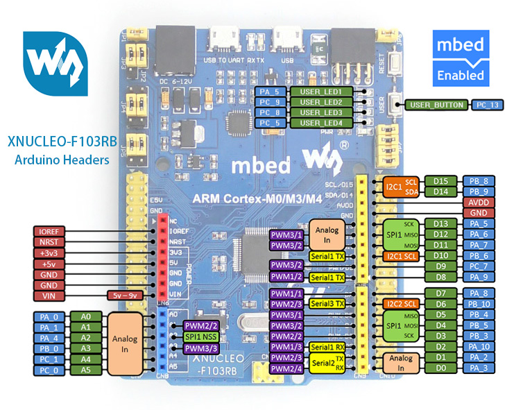

# 使用说明


## 开发板信息

厂商: 微雪

特点: 管脚布局兼容Arduino, Arduino的拓展板可以直接拿来用

产品WIKI： https://www.waveshare.net/wiki/XNUCLEO-F103RB

淘宝购买链接: https://item.taobao.com/item.htm?spm=a1z0d.7625083.1998302264.5.5c5f4e69bBw7pq&id=570972635443




* 串口日志输出

  使用UART1， 对应板子上的PA10跟PA9

  当然也可以选择UART3, 只有发送的功能Serial3 TX, 非常适合日志输出的功能

  UART1也可以用作跟OpenMV进行通信,

* 串口，跟DBSP主板通信

  从布局来看, 开发板的D0，D1使用的是UART2, 波特率应该设置为57600

  ```c
  #define USART2_TX_GPIO_PORT GPIOA
  #define USART2_TX_GPIO_PIN GPIO_Pin_2
  #define USART2_RX_GPIO_PORT GPIOA
  #define USART2_RX_GPIO_PIN  GPIO_Pin_3
  ```

* 用户按键是PC13

  这个可能用不上，因为插上DBSP拓展板也会盖住。 

* ADC采样，可以使用`PA_0`管脚

  > 之前小车上用的是PA5， 板子上没有引用，可用的就五个ADC的PIN


## 接线说明

| USB转TTL模块 | STM32F103 |
| ------------ | --------- |
| TX           | PA10      |
| RX           | PA9       |
| 3.3V         | 3.3V      |
| GND          | GND       |


| DBSP拓展板 | STM32F103 |
| ---------- | --------- |
| RX（D0）   | PA2(TX)   |
| TX(D1)     | PA3(RX)   |
| VIN(5V)    | 5V        |
| GND        | GND       |


## 修改MarcoID

`main.c`

修改MaroId跟周期，也可以自己定义相关的函数还有宏定义

```c
// 巨集的配置文件, 需要跟DBSP工程文件同步
#define MARCO0_ID (uint32_t)1513264628 // 动作组Marco0的ID号
#define MARCO0_INTERVAL 2000 // 动作组Marco0的周期,单位ms

#define MARCO1_ID (uint32_t)251853078 // 动作组Marco1的ID号
#define MARCO1_INTERVAL 2000 // 动作组Marco1的周期,单位ms

#define MARCO2_ID (uint32_t)1946965611 // 动作组Marco2的ID号
#define MARCO2_INTERVAL 2000 // 动作组Marco2的周期,单位ms
```

再DBSP的上位机上，查看Marco的总时长


完整源码

```c
/*
 * Marco发送
 * --------------------------
 * 作者: 阿凯|Kyle
 * 邮箱: kyle.xing@fashionstar.com.hk
 * 更新时间: 2020/05/26
 */
 
#include "stm32f10x.h"
#include "usart.h"
#include "sys_tick.h"
#include "fashion_star_dbsp_servo.h"

// 巨集的配置文件, 需要跟DBSP工程文件同步
#define MARCO0_ID (uint32_t)1513264628 // 动作组Marco0的ID号
#define MARCO0_INTERVAL 2000 // 动作组Marco0的周期,单位ms

#define MARCO1_ID (uint32_t)251853078 // 动作组Marco1的ID号
#define MARCO1_INTERVAL 2000 // 动作组Marco1的周期,单位ms

#define MARCO2_ID (uint32_t)1946965611 // 动作组Marco2的ID号
#define MARCO2_INTERVAL 2000 // 动作组Marco2的周期,单位ms

/* 执行巨集0 */
void Marco0(void){
	// 发送Marco执行指令
	DBSP_RunMarco(servoUsart, MARCO0_ID);
	// 等待Marco执行完成
	delay_ms(MARCO0_INTERVAL);
}

/* 执行巨集1 */
void Marco1(void){
	// 发送Marco执行指令
	DBSP_RunMarco(servoUsart, MARCO1_ID);
	// 等待Marco执行完成
	delay_ms(MARCO1_INTERVAL);
}

/* 执行巨集2 */
void Marco2(void){
	// 发送Marco执行指令
	DBSP_RunMarco(servoUsart, MARCO2_ID);
	// 等待Marco执行完成
	delay_ms(MARCO2_INTERVAL);
}

int main (void)
{
	SysTick_Init(); 			// 嘀嗒定时器初始化
	Usart_Init(); 				// 串口初始化

	while (1){
		printf("Excute Marco0");
		Marco0();
		delay_ms(1000);

		printf("Excute Marco1");
		Marco1();
		delay_ms(1000);

		printf("Excute Marco2");
		Marco2();
		delay_ms(1000);
	}
}

```

